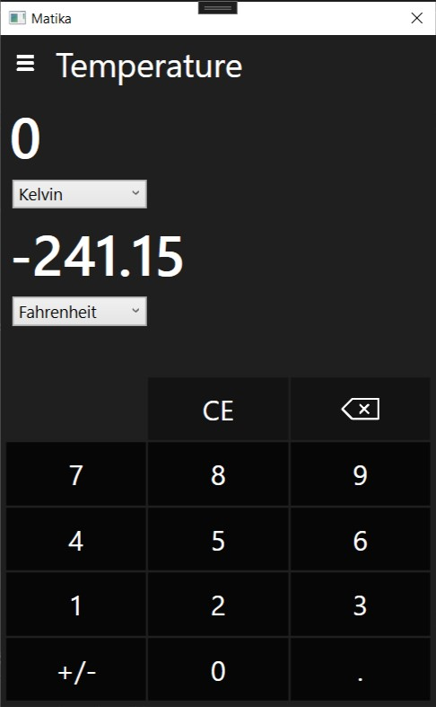
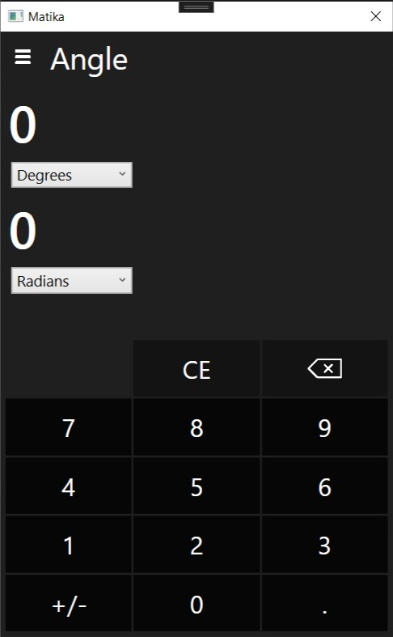

## Matika
This is a desktop application that converts quantities expressed in various systems of measurement to their equivalents in other systems of measurement. It's a clone of the Windows Calculator.

 

